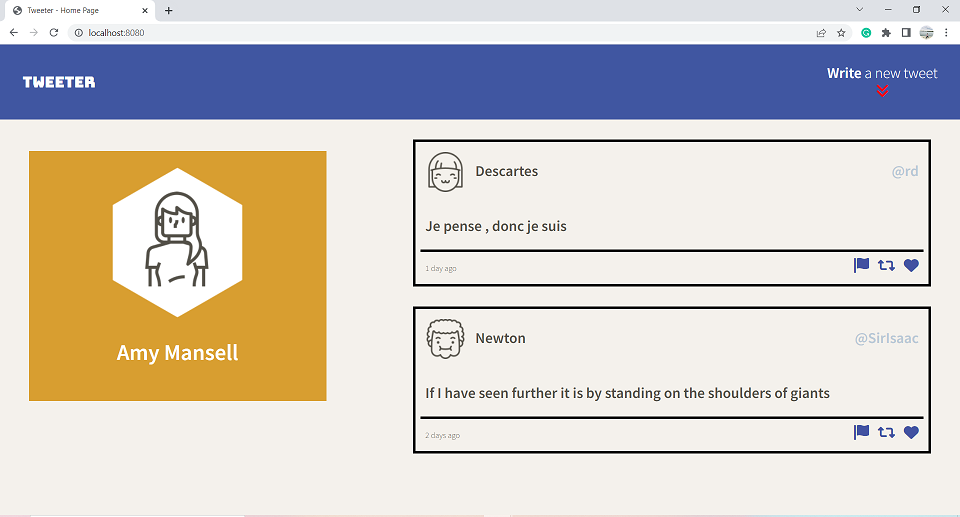
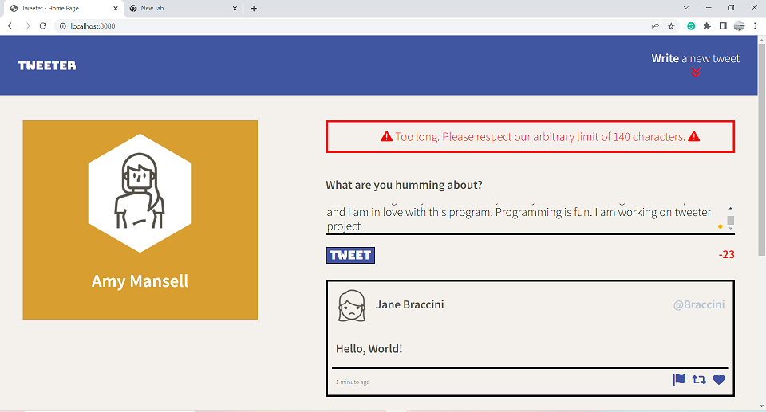
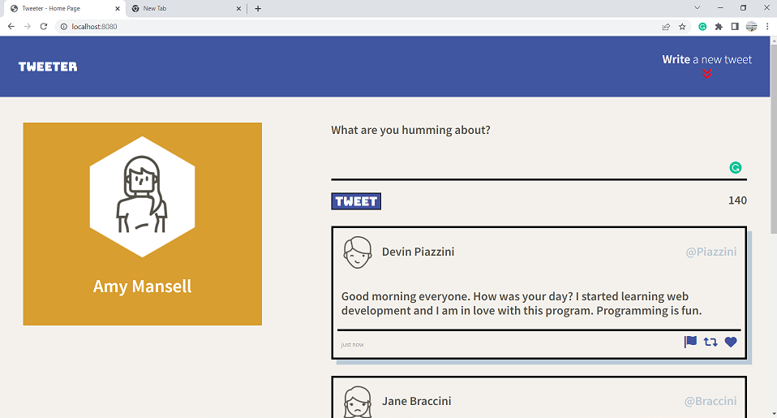
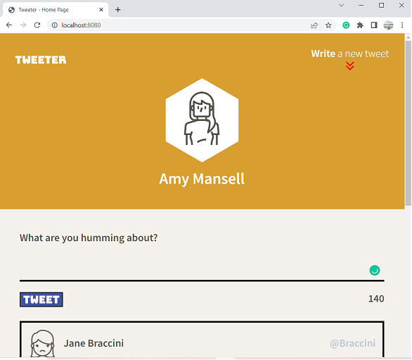
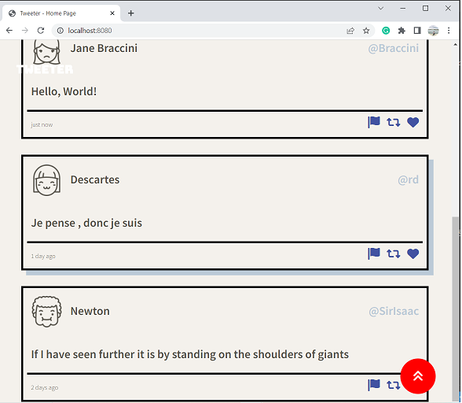

# Tweeter Project

Tweeter is a simple, single-page Ajax-based Twitter clone that uses jQuery, HTML5 and CSS to help get comfortable with front-end chops with those technologies.

# Features

- Add external fonts.
- Navigation bar is fixed.
- Use of flexbox in design implementation.
- Form(create new tweet) submission with jQuery.
- Fetching tweets with AJAX.
- New tweet is visible at the top.
- Validation errors in form with jQuery.
- Character counnter when writing tweet.
- Responsive design
- Use of SASS variables to store applications colors and fonts, and nesting.

## Getting Started

1. [Create](https://docs.github.com/en/repositories/creating-and-managing-repositories/creating-a-repository-from-a-template) a new repository using this repository as a template.
2. Clone your repository onto your local device.
3. Install dependencies using the `npm install` command.
3. Start the web server using the `npm run local` command. The app will be served at <http://localhost:8080/>.
4. Go to <http://localhost:8080/> in your browser.

## Dependencies

- Express
- Node 5.10.x or above
- body-parser
- chance
- md5

## Screenshots

- After starting the server, when we will go to <http://localhost:8080/> in the browser, this is how our page will look like.
  - 

- After clicking the Write a new tweet button in a navigation bar, the form to write a new tweet will appear. The characters of the tweet will be counted when will write. If the character exceeds 140, and if we click the tweet button, we will get an error as shown.
  - 

- If our tweet is less than or equal to 140 characters, it will be tweeted and we can see our tweet as shown.
  - 

- Our application follows a responsive design. If the screen size is less than 1024 px, the layout switches from a two-column layout to a one-column layout, as shown 
  - 

- When we scroll down, the toggle button will appear on the bottom right corner, which will scroll back to the top after clicking it.
  - 

